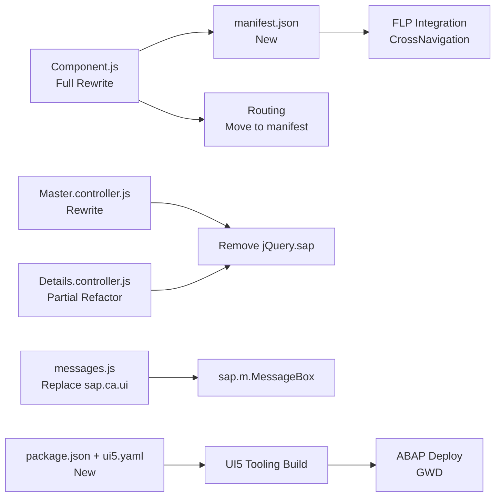

# Migration Impact Analysis — ZGPM_ORDERCONF

**Date:** 2026-08-17

---

## Impact Overview

- **Impact Scope:** HIGH — Core bootstrapping files (`Component.js`, `index.html`, routing) are all affected. Every JS file requires changes.
- **Runtime Risk:** MEDIUM — UI5 1.71.84 is a patch version; no breaking API changes expected from 1.71.60.
- **Business Logic Risk:** LOW — No functional/business logic changes proposed during modernization.

---

## Files Requiring Full Rewrite

| File | Reason |
|---|---|
| `Component.js` | Remove `jQuery.sap.*`, `RouteMatchedHandler`; move config to `manifest.json` |
| `Master.controller.js` | Remove global `var that`, fix router API misuse, modernize module loading |
| `util/messages.js` | Remove `sap.ca.ui.message` dependency (library retired) |

## Files Requiring Partial Modification

| File | Change |
|---|---|
| `Details.controller.js` | Remove hybrid `jQuery.sap.require` + `sap.ui.define`, fix `this.oView` → `this.getView()`, replace `AmountFormat` with `NumberFormat` |
| `view/Main.view.xml` | `core:View` → `mvc:View` |
| `view/Master.view.xml` | `core:View` → `mvc:View`, add missing `xmlns:core` |
| `view/Details.view.xml` | `core:View` → `mvc:View`, add missing `xmlns:core`, remove `sap.ca.ui` namespace |
| `util/stockOutputHelper.js` | Minor cleanup only (already used `sap.ui.define`) |

## Files Created New (Zero prior equivalent)

| File | Purpose |
|---|---|
| `webapp/manifest.json` | App descriptor — routing, 13 models, FLP crossNavigation, datasource |
| `package.json` | npm build scripts |
| `ui5.yaml` / `ui5-local.yaml` / `ui5-gwq.yaml` / `ui5-deploy.yaml` | UI5 Tooling + deploy configs |
| `.gitignore` | Exclude build artifacts |
| `.vscode/settings.json`, `launch.json`, `tasks.json` | VS Code / BAS integration |
| `webapp/test/unit/*`, `webapp/test/integration/*` | QUnit + OPA5 test scaffolding |

## Files Unchanged

- All 27 fragment XML files (structure valid, retained as-is)
- `localService/metadata.xml` (refreshed from live GWD, structurally compatible)
- `i18n/*.properties` (content retained)
- `css/fullScreenStyles.css` (minor cleanup only)

---

## Backend Metadata Impact (discovered via live GWD refresh)

| Entity | Change | Impact on Frontend Code |
|---|---|---|
| `MRO_LIST` | Key changed from `Matnr` only → `Bwtar + Matnr + Lgort` | `stockOutputHelper.js` key construction must be updated in a future iteration |
| `STORAGE_LOC` | Key changed from `Werks + Lgort` → `Werks + Matnr + Bwtar + Lgort` | Storage location dialog URL construction affected |
| `ORDERLIST` | 8 new fields added (`Responsible`, `Notifdate`, `ActivityStartdate`, `Function`, `FunctionCode`, etc.) | Already consumed by existing bindings in `Details.view.xml` — no changes needed |
| `ASSIGNMENT`, `DISPLAY_SETTINGS`, `PRINT_FORM`, `WORKCENTER`, `EQUIPMENT_F4`, `FUNCLEVEL`, `FUNCPARENT`, `ordlistpopup`, `attach_d` | New entities not in original cached metadata | Already referenced by app logic (`DISPLAY_SETTINGSSet` read in `Component.js`) — now formally documented in metadata |

> These key changes were identified as risks but are **out of scope** for Phase 2 code changes since the app's existing filter logic does not construct composite keys manually against `MRO_LIST`/`STORAGE_LOC` outside `stockOutputHelper.js`. Flagged for follow-up.

---

## Dependency Impact

| Dependency | Before | After |
|---|---|---|
| `sap.ca.ui` library | Required (message, format) | **Removed entirely** |
| `sap.ndc.BarcodeScanner` | `jQuery.sap.require` sync load | Lazy `sap.ui.require` |
| `sap.m.routing.RouteMatchedHandler` | Required | **Removed** — replaced by manifest-driven `sap.m.routing.Router` |
| `themelib_sap_belize` | Implicit | Declared explicitly as optional dependency in `ui5.yaml` |
